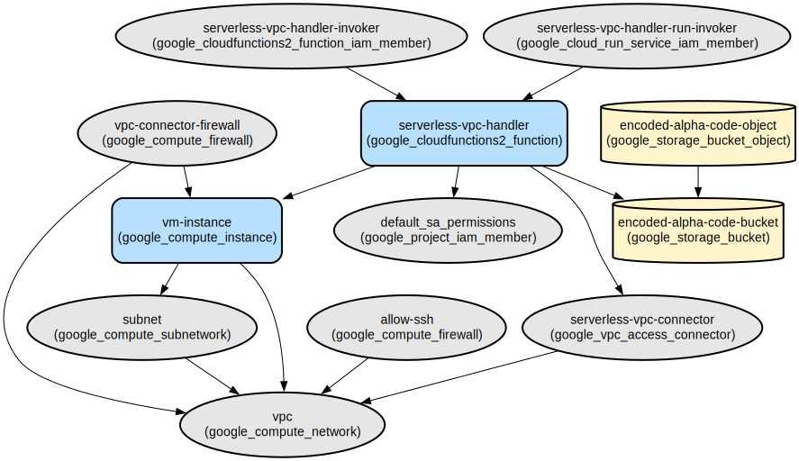

# Secure VM Access via Serverless VPC Connector

This project enables secure access to a private VM instance through a Cloud Function using Google Cloud Platform's Serverless VPC Connector. It provides a secure way to expose VM-hosted content without directly exposing the VM to the internet.

The infrastructure creates a private VM instance hosting a simple web server and a Cloud Function that acts as a secure proxy. The Cloud Function connects to the VM through a Serverless VPC Connector, allowing controlled access to the VM's content while maintaining security through network isolation. This setup is ideal for scenarios requiring secure access to private resources without direct internet exposure.

## Repository Structure
```
.
├── cloud-function/               # Cloud Function source code
│   ├── main.py                  # HTTP endpoint handler for VM access
│   └── requirements.txt         # Python dependencies
└── terraform/                   # Infrastructure as Code
    ├── main.tf                  # Main infrastructure configuration
    ├── modules/                 # Modular infrastructure components
    │   ├── cloud-run-function/  # Cloud Function deployment configuration
    │   ├── compute/            # VM instance configuration
    │   ├── firewall/          # Network security rules
    │   ├── gcs/               # Cloud Storage configuration
    │   ├── network/           # VPC and networking components
    │   ├── service-account/   # IAM and permissions
    │   └── vpc/              # VPC configuration
    ├── outputs.tf             # Infrastructure outputs
    ├── provider.tf           # GCP provider configuration
    └── variables.tf         # Infrastructure variables
```

## Usage Instructions
### Prerequisites
- Google Cloud Platform account with billing enabled
- Google Cloud SDK installed and configured
- Terraform v1.0.0 or later
- Python 3.12 or later
- Access to create GCP resources:
  - Cloud Functions
  - Compute Engine
  - VPC Networks
  - Cloud Storage
  - IAM permissions

### Installation

1. Clone the repository:
```bash
git clone <repository-url>
cd <repository-name>
```

2. Initialize Terraform:
```bash
cd terraform
terraform init
```

3. Configure the project:
```bash
# Update provider.tf with your project ID
# Update variables.tf with desired configuration
```

4. Deploy the infrastructure:
```bash
terraform plan
terraform apply
```

### Quick Start
1. After deployment, get the Cloud Function URL:
```bash
terraform output service_uri
```

2. Access the VM's content through the Cloud Function:
```bash
curl $(terraform output -raw service_uri)
```

### More Detailed Examples
1. Customizing the VM content:
```bash
# SSH into the VM and modify index.html
gcloud compute ssh vm-instance --zone=us-central1-a
echo "Custom content" > index.html
```

2. Monitoring the Cloud Function:
```bash
# View Cloud Function logs
gcloud functions logs read serverless-vpc-handler
```

### Troubleshooting
1. Cloud Function Connection Issues
   - Error: "Could not connect to VM"
   - Solution: 
     ```bash
     # Verify VPC connector status
     gcloud compute networks vpc-access connectors describe serverless-vpc-connector --region=us-central1
     ```

2. VM Access Issues
   - Error: "HTTP 503"
   - Solution:
     ```bash
     # Check VM status and web server
     gcloud compute instances describe vm-instance --zone=us-central1-a
     ```

## Data Flow
The system processes requests through a secure network path from public internet to private VM.

```ascii
[Public Internet] -> [Cloud Function] -> [VPC Connector] -> [Private VM]
                     (Proxy Layer)      (Secure Channel)    (Web Server)
```

Component interactions:
1. Client sends HTTP request to Cloud Function endpoint
2. Cloud Function authenticates and validates request
3. VPC Connector provides secure network path to VM
4. VM serves content through private network
5. Response returns through same secure path

## Infrastructure


- **VPC Network**
  - Custom VPC with private subnet (10.0.1.0/24)
  - Serverless VPC connector (10.8.0.0/28)

- **Compute**
  - VM Instance: e2-micro running Ubuntu 20.04
  - Python HTTP server on port 80

- **Security**
  - Firewall rules:
    - Allow VPC connector to VM (port 80)
    - Allow SSH access (port 22)
  - Private VM without public IP

- **Serverless**
  - Cloud Function with Python 3.12 runtime
  - 256MB memory allocation
  - Auto-scaling (1-3 instances)